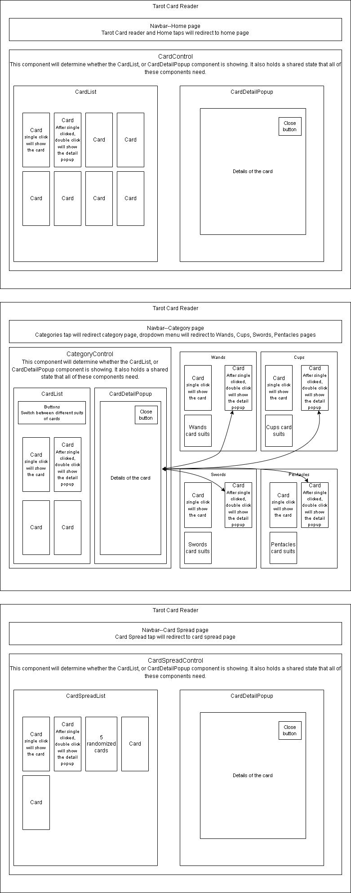
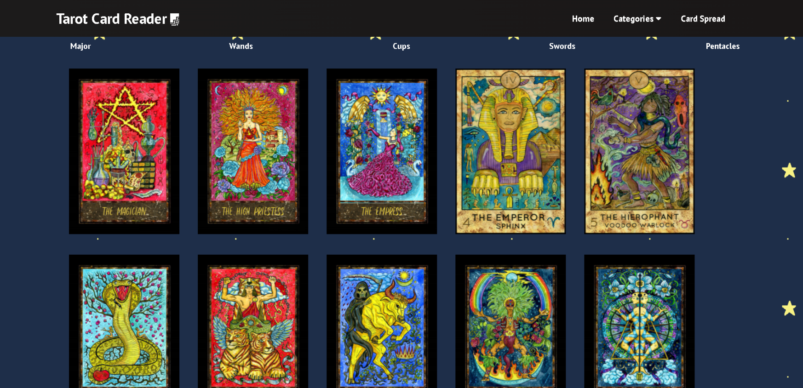

# Tarot Card Reader

#### _An App to find out what the future holds for your love life, health and career with this Tarot Card reader. Learn the meanings behind all 78 tarot cards._

#### By _**Sisi Vieira**_

## Demo Link

https://tarot-card-reader01.herokuapp.com/

## Tarot Card Reader Diagram

 

## Screen Shots

 

 

## Technologies Used

* JavaScript
* React.js
* Node.js
* API
* React Card Flip
* React Router Dom
* Git

## Description

* A user can tap a card and view its orientation.
* A user can double-tap a flipped card to read its meaning.
* A user can switch between different pages using the Navbar.
* A user can see all 78 cards from the Home menu or tap on the Tarot Card Reader title.
* To draw five random cards, visit the Card Spread page and view which cards fate have dealt you. Cards will only show their upright meanings or reversal meanings base on the card orientation.
* Use the "Try Again!" button to draw five new cards on the Card Spread page.
* To read and learn the meanings behind all 22 major arcanas and 4 suits, tap on a desired category from the categories dropdown menu. 
* A user can switch between major arcanas and 4 suits using the buttons on top of the page from the categories menu.

## Setup and Use

### Installation

1. Clone the repository: `$ git clone https://github.com/cicy886/tarot-card-reader.git`
2. Navigate to the `/tarot-card-reader` directory on your computer
3. Open with your preferred text editor to view the code base
4. To start a development server and view the project in the browser:
   - Navigate to `/tarot-card-reader` in your command line
   - Run the command `npm install` to install dependencies
   - Optionally, run the commmand `npm run build` to make a bundle of the files
   - Finally, run the command `npm run start` to start a development server

## Credits
* This web app makes use of [E Kelen's](https://github.com/ekelen) tarot-api for the tarot meanings and descriptions. repository can be found at: https://github.com/ekelen/tarot-api

## Known Bugs

No Known Bugs

## License

[MIT](https://opensource.org/licenses/MIT)

Copyright (c) **2022 Sisi Vieira**

## Contact Information

Sisi Vieira cicy886@gmail.com
